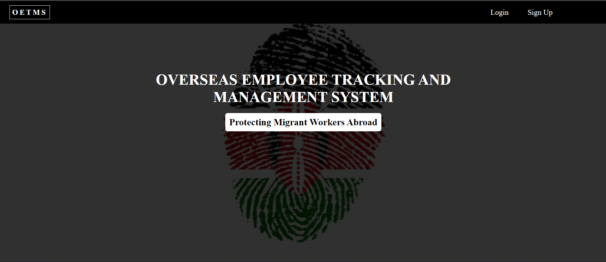

# Project Name

> OVERSEAS EMPLOYEE TRACKING AND MANAGEMENT SYSTEM

## Screenshots


## Built With
- Flask
- SQLite3
- HTML
- CSS
- JavaScript

## Getting Started

To get a local copy up and running follow these simple example steps.
1. Clone the repo from this [Github Repo](https://github.com/munyite001/OVERSEAS-EMPLOYEE-TRACKING-AND-MANAGEMENT-SYSTEM.git) (https://github.com/munyite001/OVERSEAS-EMPLOYEE-TRACKING-AND-MANAGEMENT-SYSTEM.git)
2. cd into the project directory
3. Once inside the project directory, run the command: ```pip install -r requirements.txt```
4. Once all requirements have been installed, simply start the app server by running```python app.py```
- That will start the app server and you can access it from localhost port 5000 (https://127.0.0.1:5000/)

### Prerequisites
All you need is to have a machine with python installed


## Authors

👤 **Author1**

- GitHub: [@munyite001](https://github.com/munyite001)
- LinkedIn: [LinkedIn](https://linkedin.com/in/emunyite)

## 🤝 Contributing

Contributions, issues, and feature requests are welcome!

Feel free to check the [issues page](../../issues/).

## Show your support

Give a ⭐️ if you like this project!

## 📝 License

This project is [MIT](./LICENSE) licensed.

_NOTE: we recommend using the [MIT license](https://choosealicense.com/licenses/mit/) - you can set it up quickly by [using templates available on GitHub](https://docs.github.com/en/communities/setting-up-your-project-for-healthy-contributions/adding-a-license-to-a-repository). You can also use [any other license](https://choosealicense.com/licenses/) if you wish._
